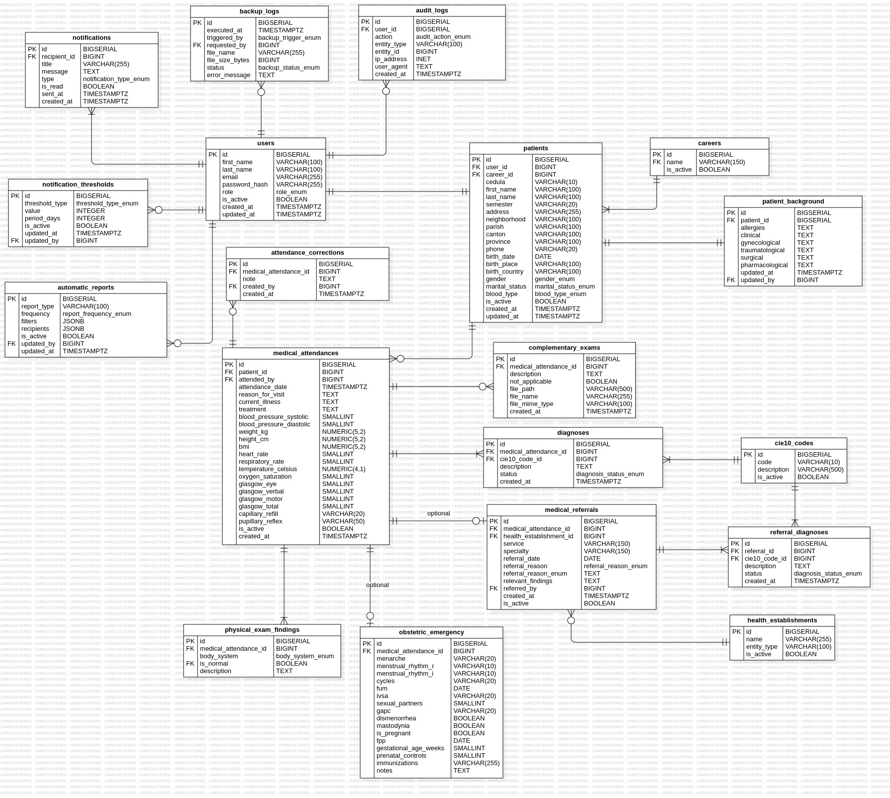

# Modelo de Datos — MEDISTA

**Proyecto:** MEDISTA — Sistema de Gestión de Atención Médica  
**Institución:** Instituto Superior Universitario TEC Azuay  
**Versión:** 1.0  
**Fecha:** 21 Abril 2026  
**Fase:** Fase 2 — Diseño del Sistema  

---

## Tabla de Contenidos

1. [Descripción General](#1-descripción-general)
2. [Principios de Diseño](#2-principios-de-diseño)
3. [Inventario de Entidades](#3-inventario-de-entidades)
4. [Definición de Entidades](#4-definición-de-entidades)
   - 4.1 [Infraestructura Transversal](#41-infraestructura-transversal)
   - 4.2 [M1 — Gestión de Pacientes](#42-m1--gestión-de-pacientes)
   - 4.3 [M2 — Atención Médica](#43-m2--atención-médica)
   - 4.4 [M3 — Referencia Médica](#44-m3--referencia-médica)
   - 4.5 [M6 — Notificaciones Inteligentes](#45-m6--notificaciones-inteligentes)
   - 4.6 [M8 — Administración del Sistema](#46-m8--administración-del-sistema)
5. [Relaciones Principales](#5-relaciones-principales)
6. [Tipos ENUM de PostgreSQL](#6-tipos-enum-de-postgresql)
7. [Extensiones PostgreSQL](#7-extensiones-postgresql)
8. [Entidades Auditadas por Hibernate Envers](#8-entidades-auditadas-por-hibernate-envers)
9. [Decisiones Arquitectónicas](#9-decisiones-arquitectónicas)

---



## 1. Descripción General

Este documento define el modelo de datos relacional completo de MEDISTA. Cubre las 19 tablas del sistema, sus columnas, tipos de dato, restricciones y relaciones entre entidades. Este modelo es la referencia autoritativa para los scripts de migración Flyway, las clases de entidad JPA y los contratos de API REST.

El motor de base de datos es **PostgreSQL 16** con las extensiones `pgcrypto` (cifrado a nivel de campo para datos clínicos sensibles) y `pg_trgm` (indexación de trigramas para la búsqueda difusa del catálogo CIE-10).

Las tablas de revisión de auditoría no están listadas en este documento — son generadas automáticamente por **Hibernate Envers** para cada entidad anotada con `@Audited`. Por cada tabla auditada, Envers produce una tabla `*_aud` correspondiente en la base de datos.

---

## 2. Principios de Diseño

**Separación de identidad y datos clínicos.** La tabla `users` gestiona únicamente autenticación y autorización. Los datos clínicos pertenecen a `patients`. Un médico tiene un registro en `users` pero no en `patients`. Un estudiante tiene ambos — vinculados mediante una clave foránea nullable.

**Eliminación lógica en todas las entidades clínicas.** Ningún registro clínico se elimina físicamente. La LOPDP y el Acuerdo MSP No. 00000125 exigen trazabilidad completa del historial clínico. Todas las tablas clínicas incluyen una columna booleana `is_active`. La eliminación se implementa como `is_active = false`.

**Inmutabilidad de las atenciones médicas.** Una atención médica guardada no puede modificarse ni eliminarse. Las correcciones se registran como notas de corrección vinculadas al registro original, preservando el historial completo tal como lo exige la normativa del MSP.

**Los catálogos son tablas, no enumeraciones de aplicación.** Las carreras, los códigos CIE-10 y los establecimientos de salud se gestionan como tablas de base de datos con operaciones CRUD administrativas. Esto permite su administración en tiempo de ejecución sin redespliegue de la aplicación.

**Los campos calculados se persisten.** El IMC y el Total de Glasgow son calculados por la aplicación pero almacenados como columnas. Esto garantiza que los registros históricos permanezcan exactos aunque las fórmulas de cálculo cambien en versiones futuras.

**Los archivos se almacenan en el sistema de ficheros, no en la base de datos.** El contenido binario de los exámenes complementarios se almacena en el sistema de ficheros del servidor. La base de datos almacena únicamente la ruta del archivo, el nombre original y el tipo MIME. Almacenar BLOBs en PostgreSQL degrada el rendimiento y complica las estrategias de respaldo.

---

## 3. Inventario de Entidades

| # | Tabla | Módulo | Descripción |
|---|-------|--------|-------------|
| 1 | `users` | Transversal | Cuentas de usuario, autenticación y gestión de roles |
| 2 | `audit_logs` | Transversal / M7 | Registro inmutable de todas las acciones relevantes de seguridad |
| 3 | `backup_logs` | Transversal / M8 | Registro de metadatos de todas las ejecuciones de respaldo de base de datos |
| 4 | `patients` | M1 | Datos demográficos e identificación del estudiante |
| 5 | `patient_background` | M1 | Antecedentes familiares y personales acumulados del paciente |
| 6 | `careers` | M1 / M8 | Catálogo de carreras académicas de la institución |
| 7 | `medical_attendances` | M2 | Registro central de la consulta clínica |
| 8 | `physical_exam_findings` | M2 | Hallazgos del examen físico por sistema corporal |
| 9 | `obstetric_emergency` | M2 | Datos obstétricos — condicional según género del paciente |
| 10 | `complementary_exams` | M2 | Registros de exámenes complementarios y archivos adjuntos |
| 11 | `diagnoses` | M2 | Diagnósticos asociados a una atención médica |
| 12 | `attendance_corrections` | M2 | Notas de corrección acumuladas sobre una atención médica inmutable |
| 13 | `cie10_codes` | M2 / M8 | Catálogo de códigos diagnósticos CIE-10 (+14.000 entradas) |
| 14 | `medical_referrals` | M3 | Registros de referencias médicas a establecimientos externos |
| 15 | `referral_diagnoses` | M3 | Diagnósticos comunicados en una referencia médica |
| 16 | `health_establishments` | M3 / M8 | Catálogo de establecimientos de salud destino de referencias |
| 17 | `notifications` | M6 | Notificaciones del sistema entregadas a los usuarios |
| 18 | `notification_thresholds` | M6 / M8 | Umbrales configurables que activan alertas automáticas |
| 19 | `automatic_reports` | M8 | Configuración de generación automática de reportes programados |

**Módulos sin tablas propias:**
- **M4 — Historial Clínico:** Consultas de solo lectura sobre `medical_attendances`, `diagnoses` y `physical_exam_findings`, filtradas por `patient_id`.
- **M5 — Dashboard Estadístico:** Consultas de agregación sobre tablas clínicas existentes. No requiere almacenamiento dedicado con el volumen de datos actual (~500 pacientes).

---

## 4. Definición de Entidades

### 4.1 Infraestructura Transversal

---

#### `users`

Gestiona todas las cuentas de usuario del sistema independientemente del rol. Esta tabla maneja exclusivamente autenticación y autorización — no se almacena ningún dato clínico aquí.

| Columna | Tipo | Restricciones | Descripción |
|---------|------|---------------|-------------|
| `id` | `BIGSERIAL` | PK | Clave primaria sustituta |
| `first_name` | `VARCHAR(100)` | NOT NULL | Nombre del usuario |
| `last_name` | `VARCHAR(100)` | NOT NULL | Apellido del usuario |
| `email` | `VARCHAR(255)` | NOT NULL, UNIQUE | Correo institucional — utilizado como identificador de inicio de sesión |
| `password_hash` | `VARCHAR(255)` | NOT NULL | Hash BCrypt de la contraseña — el texto plano nunca se almacena |
| `role` | `role_enum` | NOT NULL | Uno de: `MEDICO`, `DECANO`, `ADMINISTRADOR`, `ESTUDIANTE` |
| `is_active` | `BOOLEAN` | NOT NULL, DEFAULT true | Indicador de eliminación lógica / desactivación de cuenta |
| `created_at` | `TIMESTAMPTZ` | NOT NULL, DEFAULT now() | Marca de tiempo de creación de la cuenta |
| `updated_at` | `TIMESTAMPTZ` | NOT NULL, DEFAULT now() | Marca de tiempo de última modificación |

**Índices:** `email` (único), `role` (btree)

**Notas:** La columna `role` utiliza un tipo ENUM personalizado de PostgreSQL `role_enum` aplicado a nivel de base de datos. El hash de contraseñas es gestionado por Spring Security con BCrypt (factor de costo 12).

---

#### `audit_logs`

Registro inmutable de todas las acciones relevantes de seguridad realizadas por los usuarios. Esta tabla satisface el requisito de la LOPDP de registrar no solo las modificaciones de datos (cubiertas por Hibernate Envers) sino también los eventos de acceso — como la visualización de expedientes clínicos, la generación de PDFs y la exportación de reportes — acciones que no producen escritura en base de datos pero que deben ser trazables.

Los registros de esta tabla **nunca se eliminan**. Se recomienda el particionamiento por mes en la columna `created_at` como optimización de rendimiento a largo plazo.

| Columna | Tipo | Restricciones | Descripción |
|---------|------|---------------|-------------|
| `id` | `BIGSERIAL` | PK | Clave primaria sustituta |
| `user_id` | `BIGINT` | FK → `users.id`, NOT NULL | Usuario que realizó la acción |
| `action` | `audit_action_enum` | NOT NULL | Uno de: `LOGIN`, `LOGOUT`, `VIEW`, `CREATE`, `UPDATE`, `DELETE`, `EXPORT`, `PRINT` |
| `entity_type` | `VARCHAR(100)` | NULLABLE | Nombre de la entidad afectada (ej. `patient`, `medical_attendance`) |
| `entity_id` | `BIGINT` | NULLABLE | ID del registro afectado |
| `ip_address` | `INET` | NOT NULL | Dirección IP del cliente en el momento de la acción |
| `user_agent` | `TEXT` | NULLABLE | Cadena de agente de usuario del cliente |
| `created_at` | `TIMESTAMPTZ` | NOT NULL, DEFAULT now() | Marca de tiempo de la acción |

**Índices:** `user_id` (btree), `entity_type + entity_id` (btree), `created_at` (btree, candidato a clave de partición)

**Notas:** Solo las acciones con relevancia clínica o de seguridad generan un registro de auditoría. Los eventos de navegación e interacciones de interfaz no producen registros.

---

#### `backup_logs`

Registro de todas las ejecuciones de respaldo de base de datos, tanto automáticas como activadas manualmente. Proporciona al Administrador del Sistema visibilidad sobre el estado de los respaldos sin necesidad de acceder directamente al sistema de ficheros.

| Columna | Tipo | Restricciones | Descripción |
|---------|------|---------------|-------------|
| `id` | `BIGSERIAL` | PK | Clave primaria sustituta |
| `executed_at` | `TIMESTAMPTZ` | NOT NULL | Marca de tiempo de ejecución del respaldo |
| `triggered_by` | `backup_trigger_enum` | NOT NULL | Uno de: `AUTOMATIC`, `MANUAL` |
| `requested_by` | `BIGINT` | FK → `users.id`, NULLABLE | Usuario que activó el respaldo (nulo para respaldos automáticos) |
| `file_name` | `VARCHAR(255)` | NOT NULL | Nombre del archivo de respaldo generado |
| `file_size_bytes` | `BIGINT` | NULLABLE | Tamaño del archivo de respaldo en bytes |
| `status` | `backup_status_enum` | NOT NULL | Uno de: `SUCCESS`, `FAILED` |
| `error_message` | `TEXT` | NULLABLE | Detalle del error si el estado es `FAILED` |

---

### 4.2 M1 — Gestión de Pacientes

---

#### `patients`

Almacena los datos demográficos e identificación de cada estudiante registrado en el departamento médico. Es la entidad raíz del dominio clínico — ninguna atención médica, referencia o historial clínico puede existir sin un registro de paciente previo.

| Columna | Tipo | Restricciones | Descripción |
|---------|------|---------------|-------------|
| `id` | `BIGSERIAL` | PK | Clave primaria sustituta |
| `user_id` | `BIGINT` | FK → `users.id`, NULLABLE, UNIQUE | Cuenta de usuario asociada — nulo hasta que el estudiante activa su cuenta |
| `career_id` | `BIGINT` | FK → `careers.id`, NOT NULL | Carrera académica en la que está matriculado el estudiante |
| `cedula` | `VARCHAR(10)` | NOT NULL, UNIQUE | Número de cédula de identidad ecuatoriana — identificador único del sistema |
| `first_name` | `VARCHAR(100)` | NOT NULL | Nombre del paciente |
| `last_name` | `VARCHAR(100)` | NOT NULL | Apellido del paciente |
| `semester` | `VARCHAR(20)` | NOT NULL | Semestre o ciclo académico actual |
| `address` | `VARCHAR(255)` | NOT NULL | Dirección de domicilio |
| `neighborhood` | `VARCHAR(100)` | NULLABLE | Barrio |
| `parish` | `VARCHAR(100)` | NULLABLE | Parroquia |
| `canton` | `VARCHAR(100)` | NOT NULL | Cantón |
| `province` | `VARCHAR(100)` | NOT NULL | Provincia |
| `phone` | `VARCHAR(20)` | NOT NULL | Número de teléfono de contacto |
| `birth_date` | `DATE` | NOT NULL | Fecha de nacimiento — la edad se calcula dinámicamente, no se almacena |
| `birth_place` | `VARCHAR(100)` | NULLABLE | Ciudad o lugar de nacimiento |
| `birth_country` | `VARCHAR(100)` | NOT NULL, DEFAULT 'Ecuador' | País de nacimiento |
| `gender` | `gender_enum` | NOT NULL | Uno de: `MALE`, `FEMALE` |
| `marital_status` | `marital_status_enum` | NOT NULL | Uno de: `SINGLE`, `MARRIED`, `WIDOWED`, `DIVORCED`, `FREE_UNION` |
| `blood_type` | `blood_type_enum` | NOT NULL | Uno de: `A_POSITIVE`, `A_NEGATIVE`, `B_POSITIVE`, `B_NEGATIVE`, `AB_POSITIVE`, `AB_NEGATIVE`, `O_POSITIVE`, `O_NEGATIVE` |
| `is_active` | `BOOLEAN` | NOT NULL, DEFAULT true | Indicador de eliminación lógica |
| `created_at` | `TIMESTAMPTZ` | NOT NULL, DEFAULT now() | Marca de tiempo de creación del registro |
| `updated_at` | `TIMESTAMPTZ` | NOT NULL, DEFAULT now() | Marca de tiempo de última modificación |

**Índices:** `cedula` (único), `user_id` (único), `last_name + first_name` (btree), `career_id` (btree)

**Notas:** La edad nunca se almacena — se calcula en tiempo de consulta a partir de `birth_date`. Almacenar la edad requeriría actualizaciones constantes y produciría datos desactualizados. La columna `gender` determina la visualización condicional de la sección obstétrica en el formulario de atención médica.

---

#### `patient_background`

Almacena los antecedentes familiares y personales acumulados de un paciente. A diferencia de las atenciones médicas, este registro no es inmutable — se actualiza conforme evolucionan los antecedentes del paciente. Todos los cambios son rastreados por Hibernate Envers.

Un registro por paciente (relación 1:1). Se crea en el momento del primer registro y se actualiza posteriormente.

| Columna | Tipo | Restricciones | Descripción |
|---------|------|---------------|-------------|
| `id` | `BIGSERIAL` | PK | Clave primaria sustituta |
| `patient_id` | `BIGINT` | FK → `patients.id`, NOT NULL, UNIQUE | Paciente propietario del registro |
| `allergies` | `TEXT` | NULLABLE | Antecedentes alérgicos — texto libre |
| `clinical` | `TEXT` | NULLABLE | Antecedentes clínicos — texto libre |
| `gynecological` | `TEXT` | NULLABLE | Antecedentes ginecológicos — texto libre |
| `traumatological` | `TEXT` | NULLABLE | Antecedentes traumatológicos — texto libre |
| `surgical` | `TEXT` | NULLABLE | Antecedentes quirúrgicos — texto libre |
| `pharmacological` | `TEXT` | NULLABLE | Antecedentes farmacológicos — texto libre |
| `updated_at` | `TIMESTAMPTZ` | NOT NULL, DEFAULT now() | Marca de tiempo de última modificación |
| `updated_by` | `BIGINT` | FK → `users.id`, NOT NULL | Usuario que realizó la última modificación |

**Notas:** Los seis campos de antecedentes son nullable — el registro se crea con valores nulos en el momento del registro del paciente y se va completando conforme la médico recopila información en consultas sucesivas. Las tablas de auditoría de Envers capturan cada versión histórica.

---

#### `careers`

Catálogo de carreras académicas ofrecidas por la institución. Normaliza los datos de carrera en los registros de pacientes y permite agrupaciones consistentes en reportes estadísticos.

| Columna | Tipo | Restricciones | Descripción |
|---------|------|---------------|-------------|
| `id` | `BIGSERIAL` | PK | Clave primaria sustituta |
| `name` | `VARCHAR(150)` | NOT NULL, UNIQUE | Nombre completo de la carrera académica |
| `is_active` | `BOOLEAN` | NOT NULL, DEFAULT true | Indicador de eliminación lógica / desactivación |

**Datos iniciales:** 16 registros correspondientes a las carreras actuales de la institución. Cargados mediante migración semilla de Flyway en el primer despliegue.

---

### 4.3 M2 — Atención Médica

---

#### `medical_attendances`

La entidad clínica central del sistema. Cada registro representa una consulta médica completa, mapeando directamente al formulario físico de atención médica actualmente utilizado por el departamento. Es la tabla más compleja del modelo.

Los registros de esta tabla son **inmutables tras su creación**. No se permiten operaciones UPDATE sobre campos clínicos. Las correcciones se gestionan mediante un mecanismo de nota de corrección de solo adición.

| Columna | Tipo | Restricciones | Descripción |
|---------|------|---------------|-------------|
| `id` | `BIGSERIAL` | PK | Clave primaria sustituta |
| `patient_id` | `BIGINT` | FK → `patients.id`, NOT NULL | Paciente que recibe la consulta |
| `attended_by` | `BIGINT` | FK → `users.id`, NOT NULL | Médico que creó el registro |
| `attendance_date` | `TIMESTAMPTZ` | NOT NULL, DEFAULT now() | Fecha y hora de la consulta |
| `reason_for_visit` | `TEXT` | NOT NULL | Motivo de consulta — texto libre |
| `current_illness` | `TEXT` | NULLABLE | Descripción de la enfermedad actual — texto libre |
| `treatment` | `TEXT` | NULLABLE | Tratamiento prescrito — texto libre |
| `blood_pressure_systolic` | `SMALLINT` | NULLABLE | Presión arterial sistólica (mmHg) |
| `blood_pressure_diastolic` | `SMALLINT` | NULLABLE | Presión arterial diastólica (mmHg) |
| `weight_kg` | `NUMERIC(5,2)` | NULLABLE | Peso corporal en kilogramos |
| `height_cm` | `NUMERIC(5,2)` | NULLABLE | Talla en centímetros |
| `bmi` | `NUMERIC(5,2)` | NULLABLE | Índice de Masa Corporal — calculado por la aplicación, persistido para exactitud histórica |
| `heart_rate` | `SMALLINT` | NULLABLE | Frecuencia cardíaca (lpm) |
| `respiratory_rate` | `SMALLINT` | NULLABLE | Frecuencia respiratoria (resp/min) |
| `temperature_celsius` | `NUMERIC(4,1)` | NULLABLE | Temperatura corporal en grados Celsius |
| `oxygen_saturation` | `SMALLINT` | NULLABLE | Saturación periférica de oxígeno (%) |
| `glasgow_eye` | `SMALLINT` | NULLABLE | Escala de Glasgow — apertura ocular (1–4) |
| `glasgow_verbal` | `SMALLINT` | NULLABLE | Escala de Glasgow — respuesta verbal (1–5) |
| `glasgow_motor` | `SMALLINT` | NULLABLE | Escala de Glasgow — respuesta motora (1–6) |
| `glasgow_total` | `SMALLINT` | NULLABLE | Total Escala de Glasgow — calculado por la aplicación, persistido |
| `capillary_refill` | `VARCHAR(20)` | NULLABLE | Descripción del llenado capilar |
| `pupillary_reflex` | `VARCHAR(50)` | NULLABLE | Hallazgos del reflejo pupilar |
| `is_active` | `BOOLEAN` | NOT NULL, DEFAULT true | Indicador de eliminación lógica |
| `created_at` | `TIMESTAMPTZ` | NOT NULL, DEFAULT now() | Marca de tiempo de creación del registro |

**Índices:** `patient_id` (btree), `attended_by` (btree), `attendance_date` (btree), `is_active` (btree)

---

#### `attendance_corrections`

Almacena las notas de corrección sobre una atención médica ya guardada. Dado que las atenciones son inmutables, cualquier enmienda posterior se registra aquí como un nuevo registro acumulativo — nunca se sobreescribe ni elimina una corrección existente.

Un médico puede agregar múltiples correcciones a la misma atención a lo largo del tiempo. Cada corrección queda fechada y firmada, preservando la trazabilidad completa exigida por la normativa MSP.

| Columna | Tipo | Restricciones | Descripción |
|---------|------|---------------|-------------|
| `id` | `BIGSERIAL` | PK | Clave primaria sustituta |
| `medical_attendance_id` | `BIGINT` | FK → `medical_attendances.id`, NOT NULL | Atención médica a la que pertenece esta corrección |
| `note` | `TEXT` | NOT NULL | Texto de la corrección ingresado por la médico |
| `created_by` | `BIGINT` | FK → `users.id`, NOT NULL | Médico que registró la corrección |
| `created_at` | `TIMESTAMPTZ` | NOT NULL, DEFAULT now() | Marca de tiempo de la corrección |

**Índices:** `medical_attendance_id` (btree)

---

#### `physical_exam_findings`

Almacena los hallazgos del examen físico por sistema corporal para una atención médica. El examen físico cubre 9 sistemas — cada sistema produce un registro en esta tabla, resultando en exactamente 9 filas por atención.

| Columna | Tipo | Restricciones | Descripción |
|---------|------|---------------|-------------|
| `id` | `BIGSERIAL` | PK | Clave primaria sustituta |
| `medical_attendance_id` | `BIGINT` | FK → `medical_attendances.id`, NOT NULL | Atención propietaria |
| `body_system` | `body_system_enum` | NOT NULL | Uno de: `SKIN_AND_ANNEXES`, `HEAD`, `NECK`, `THORAX`, `HEART`, `ABDOMEN`, `INGUINAL`, `UPPER_LIMBS`, `LOWER_LIMBS` |
| `is_normal` | `BOOLEAN` | NOT NULL | Hallazgo normal (true) o anormal (false) |
| `description` | `TEXT` | NULLABLE | Descripción en texto libre — requerida cuando `is_normal` es false |

**Restricciones:** UNIQUE (`medical_attendance_id`, `body_system`) — un hallazgo por sistema por atención.

---

#### `obstetric_emergency`

Almacena los datos obstétricos recopilados durante una atención médica. Esta sección es condicional — aplica únicamente a pacientes de género femenino. Un registro por atención, creado solo cuando el género del paciente es `FEMALE`.

| Columna | Tipo | Restricciones | Descripción |
|---------|------|---------------|-------------|
| `id` | `BIGSERIAL` | PK | Clave primaria sustituta |
| `medical_attendance_id` | `BIGINT` | FK → `medical_attendances.id`, NOT NULL, UNIQUE | Atención propietaria |
| `menarche` | `VARCHAR(20)` | NULLABLE | Edad de la primera menstruación |
| `menstrual_rhythm_r` | `VARCHAR(10)` | NULLABLE | Ritmo menstrual — valor R |
| `menstrual_rhythm_i` | `VARCHAR(10)` | NULLABLE | Ritmo menstrual — valor I |
| `cycles` | `VARCHAR(20)` | NULLABLE | Descripción de los ciclos menstruales |
| `fum` | `DATE` | NULLABLE | Fecha de la última menstruación |
| `ivsa` | `VARCHAR(20)` | NULLABLE | Inicio de vida sexual activa |
| `sexual_partners` | `SMALLINT` | NULLABLE | Número de parejas sexuales |
| `gapc` | `VARCHAR(20)` | NULLABLE | Fórmula obstétrica G-A-P-C |
| `dismenorrhea` | `BOOLEAN` | NOT NULL, DEFAULT false | Indicador de dismenorrea |
| `mastodynia` | `BOOLEAN` | NOT NULL, DEFAULT false | Indicador de mastodinia |
| `is_pregnant` | `BOOLEAN` | NOT NULL, DEFAULT false | Indicador de embarazo actual |
| `fpp` | `DATE` | NULLABLE | Fecha probable de parto |
| `gestational_age_weeks` | `SMALLINT` | NULLABLE | Edad gestacional en semanas |
| `prenatal_controls` | `SMALLINT` | NULLABLE | Número de controles prenatales |
| `immunizations` | `VARCHAR(255)` | NULLABLE | Notas de inmunizaciones |
| `notes` | `TEXT` | NULLABLE | Notas obstétricas adicionales |

---

#### `complementary_exams`

Registra los exámenes complementarios solicitados o revisados durante una atención médica. Una atención puede tener múltiples exámenes complementarios. Los archivos adjuntos (PDF, JPG, PNG) se almacenan en el sistema de ficheros del servidor — esta tabla almacena únicamente los metadatos de referencia.

| Columna | Tipo | Restricciones | Descripción |
|---------|------|---------------|-------------|
| `id` | `BIGSERIAL` | PK | Clave primaria sustituta |
| `medical_attendance_id` | `BIGINT` | FK → `medical_attendances.id`, NOT NULL | Atención propietaria |
| `description` | `TEXT` | NULLABLE | Descripción del examen o resultado |
| `not_applicable` | `BOOLEAN` | NOT NULL, DEFAULT false | Marca la opción "No Aplica" del formulario físico |
| `file_path` | `VARCHAR(500)` | NULLABLE | Ruta relativa al archivo almacenado en el sistema de ficheros del servidor |
| `file_name` | `VARCHAR(255)` | NULLABLE | Nombre original del archivo tal como fue subido por la médico |
| `file_mime_type` | `VARCHAR(100)` | NULLABLE | Tipo MIME del archivo (ej. `application/pdf`, `image/jpeg`) |
| `created_at` | `TIMESTAMPTZ` | NOT NULL, DEFAULT now() | Marca de tiempo de creación del registro |

---

#### `diagnoses`

Almacena uno o más diagnósticos asociados a una atención médica. Cada diagnóstico está vinculado a una entrada del catálogo CIE-10 y clasificado como presuntivo o definitivo.

| Columna | Tipo | Restricciones | Descripción |
|---------|------|---------------|-------------|
| `id` | `BIGSERIAL` | PK | Clave primaria sustituta |
| `medical_attendance_id` | `BIGINT` | FK → `medical_attendances.id`, NOT NULL | Atención propietaria |
| `cie10_code_id` | `BIGINT` | FK → `cie10_codes.id`, NOT NULL | Código diagnóstico CIE-10 — integridad referencial aplicada a nivel de base de datos |
| `description` | `TEXT` | NULLABLE | Descripción en texto libre del diagnóstico tal como lo ingresó la médico |
| `status` | `diagnosis_status_enum` | NOT NULL | Uno de: `PRESUMPTIVE`, `DEFINITIVE` |
| `created_at` | `TIMESTAMPTZ` | NOT NULL, DEFAULT now() | Marca de tiempo de creación del registro |

---

#### `cie10_codes`

Catálogo de códigos diagnósticos CIE-10 (Clasificación Internacional de Enfermedades, 10.ª revisión). Cargado con más de 14.000 entradas mediante una migración masiva de Flyway en el primer despliegue. Utilizado por la función de autocompletado de diagnósticos en tiempo real.

| Columna | Tipo | Restricciones | Descripción |
|---------|------|---------------|-------------|
| `id` | `BIGSERIAL` | PK | Clave primaria sustituta |
| `code` | `VARCHAR(10)` | NOT NULL, UNIQUE | Código alfanumérico CIE-10 (ej. `J00`, `A09.0`) |
| `description` | `VARCHAR(500)` | NOT NULL | Nombre completo del diagnóstico en español |
| `is_active` | `BOOLEAN` | NOT NULL, DEFAULT true | Permite la desactivación de códigos obsoletos sin eliminarlos |

**Índices:** `code` (único, btree), `description` (GIN con `pg_trgm`) — el índice de trigramas sobre `description` habilita la búsqueda difusa en menos de 500ms sobre más de 14.000 entradas.

---

### 4.4 M3 — Referencia Médica

---

#### `medical_referrals`

Registra las referencias médicas generadas cuando un paciente requiere atención más allá de la capacidad del departamento. Toda referencia debe originarse desde una atención médica existente — no se permiten referencias independientes por regla de negocio.

| Columna | Tipo | Restricciones | Descripción |
|---------|------|---------------|-------------|
| `id` | `BIGSERIAL` | PK | Clave primaria sustituta |
| `medical_attendance_id` | `BIGINT` | FK → `medical_attendances.id`, NOT NULL, UNIQUE | Atención de origen — máximo una referencia por atención |
| `health_establishment_id` | `BIGINT` | FK → `health_establishments.id`, NOT NULL | Establecimiento de salud destino |
| `service` | `VARCHAR(150)` | NULLABLE | Servicio o unidad específica en el establecimiento destino |
| `specialty` | `VARCHAR(150)` | NULLABLE | Especialidad médica solicitada |
| `referral_date` | `DATE` | NOT NULL | Fecha de la referencia |
| `referral_reason` | `referral_reason_enum` | NOT NULL | Uno de: `LIMITED_RESOLUTION`, `LACK_OF_PROFESSIONAL`, `OTHER` |
| `clinical_summary` | `TEXT` | NULLABLE | Resumen del cuadro clínico |
| `relevant_findings` | `TEXT` | NULLABLE | Hallazgos relevantes comunicados al médico receptor |
| `referred_by` | `BIGINT` | FK → `users.id`, NOT NULL | Médico que emite la referencia |
| `created_at` | `TIMESTAMPTZ` | NOT NULL, DEFAULT now() | Marca de tiempo de creación del registro |
| `is_active` | `BOOLEAN` | NOT NULL, DEFAULT true | Indicador de eliminación lógica |

**Notas:** El nombre de la institución ("Instituto Superior Universitario TEC Azuay") y la etiqueta de servicio ("Departamento Médico") son constantes del sistema inyectadas en el momento de la generación del PDF. No se persisten en esta tabla.

---

#### `referral_diagnoses`

Diagnósticos comunicados en una referencia médica. Se mantiene separada de `diagnoses` (diagnósticos de la atención) porque representa el cuadro clínico comunicado al establecimiento receptor — puede diferir o ser un subconjunto de los diagnósticos de la atención.

| Columna | Tipo | Restricciones | Descripción |
|---------|------|---------------|-------------|
| `id` | `BIGSERIAL` | PK | Clave primaria sustituta |
| `referral_id` | `BIGINT` | FK → `medical_referrals.id`, NOT NULL | Referencia propietaria |
| `cie10_code_id` | `BIGINT` | FK → `cie10_codes.id`, NOT NULL | Código diagnóstico CIE-10 |
| `description` | `TEXT` | NULLABLE | Descripción en texto libre del diagnóstico |
| `status` | `diagnosis_status_enum` | NOT NULL | Uno de: `PRESUMPTIVE`, `DEFINITIVE` |
| `created_at` | `TIMESTAMPTZ` | NOT NULL, DEFAULT now() | Marca de tiempo de creación del registro |

---

#### `health_establishments`

Catálogo de establecimientos de salud disponibles como destino de referencias médicas. Gestionado por el Administrador del Sistema desde el módulo M8.

| Columna | Tipo | Restricciones | Descripción |
|---------|------|---------------|-------------|
| `id` | `BIGSERIAL` | PK | Clave primaria sustituta |
| `name` | `VARCHAR(255)` | NOT NULL | Nombre completo del establecimiento de salud |
| `entity_type` | `VARCHAR(100)` | NULLABLE | Tipo de entidad (ej. hospital, clínica, centro especializado) |
| `is_active` | `BOOLEAN` | NOT NULL, DEFAULT true | Indicador de eliminación lógica / desactivación |

---

### 4.5 M6 — Notificaciones Inteligentes

---

#### `notifications`

Almacena todas las notificaciones del sistema entregadas a los usuarios. Las notificaciones se generan automáticamente por el sistema según los umbrales configurados (alertas clínicas, patrones epidemiológicos, alertas de volumen institucional).

| Columna | Tipo | Restricciones | Descripción |
|---------|------|---------------|-------------|
| `id` | `BIGSERIAL` | PK | Clave primaria sustituta |
| `recipient_id` | `BIGINT` | FK → `users.id`, NOT NULL | Usuario que recibe la notificación |
| `title` | `VARCHAR(255)` | NOT NULL | Título corto de la notificación |
| `message` | `TEXT` | NOT NULL | Cuerpo completo del mensaje de notificación |
| `type` | `notification_type_enum` | NOT NULL | Uno de: `CLINICAL`, `EPIDEMIOLOGICAL`, `INSTITUTIONAL` |
| `is_read` | `BOOLEAN` | NOT NULL, DEFAULT false | Indicador de estado de lectura |
| `sent_at` | `TIMESTAMPTZ` | NULLABLE | Marca de tiempo de envío de la notificación |
| `created_at` | `TIMESTAMPTZ` | NOT NULL, DEFAULT now() | Marca de tiempo de creación del registro |

**Índices:** `recipient_id + is_read` (btree) — optimiza las consultas de conteo de notificaciones no leídas.

---

#### `notification_thresholds`

Umbrales configurables que activan la generación automática de alertas. Gestionados exclusivamente por el Administrador del Sistema. Estos valores impulsan la lógica de evaluación del motor de notificaciones.

| Columna | Tipo | Restricciones | Descripción |
|---------|------|---------------|-------------|
| `id` | `BIGSERIAL` | PK | Clave primaria sustituta |
| `threshold_type` | `threshold_type_enum` | NOT NULL, UNIQUE | Uno de: `PATIENT_VISITS`, `EPIDEMIOLOGICAL`, `INSTITUTIONAL` |
| `value` | `INTEGER` | NOT NULL | Valor umbral que activa la alerta |
| `period_days` | `INTEGER` | NOT NULL | Ventana de evaluación en días |
| `is_active` | `BOOLEAN` | NOT NULL, DEFAULT true | Habilita o deshabilita este umbral |
| `updated_at` | `TIMESTAMPTZ` | NOT NULL, DEFAULT now() | Marca de tiempo de última modificación |
| `updated_by` | `BIGINT` | FK → `users.id`, NOT NULL | Administrador que modificó este umbral por última vez |

---

### 4.6 M8 — Administración del Sistema

---

#### `automatic_reports`

Registros de configuración para la generación automática programada de reportes. Cada registro define un trabajo de reporte con su frecuencia, filtros aplicados y lista de destinatarios.

| Columna | Tipo | Restricciones | Descripción |
|---------|------|---------------|-------------|
| `id` | `BIGSERIAL` | PK | Clave primaria sustituta |
| `report_type` | `VARCHAR(100)` | NOT NULL | Identificador de la plantilla de reporte a generar |
| `frequency` | `report_frequency_enum` | NOT NULL | Uno de: `WEEKLY`, `MONTHLY`, `BIANNUAL` |
| `filters` | `JSONB` | NULLABLE | Configuración dinámica de filtros — almacenada como JSON para flexibilidad |
| `recipients` | `JSONB` | NOT NULL | Lista de correos electrónicos de destinatarios — almacenada como arreglo JSON |
| `is_active` | `BOOLEAN` | NOT NULL, DEFAULT true | Habilita o deshabilita este trabajo de reporte |
| `updated_by` | `BIGINT` | FK → `users.id`, NOT NULL | Administrador que modificó esta configuración por última vez |
| `updated_at` | `TIMESTAMPTZ` | NOT NULL, DEFAULT now() | Marca de tiempo de última modificación |

---

## 5. Relaciones Principales

| Relación | Tipo | Descripción |
|----------|------|-------------|
| `users` → `patients` | 1:1 opcional | Un usuario estudiante tiene exactamente un registro de paciente. Un paciente puede existir sin cuenta de usuario (aún no activada). Un usuario médico no tiene registro de paciente. |
| `patients` → `patient_background` | 1:1 obligatoria | Cada paciente tiene exactamente un registro de antecedentes, creado en el momento del registro. |
| `patients` → `careers` | N:1 | Muchos pacientes pertenecen a una misma carrera. |
| `patients` → `medical_attendances` | 1:N | Un paciente puede tener muchas atenciones médicas a lo largo del tiempo. |
| `medical_attendances` → `physical_exam_findings` | 1:N (fijo 9) | Cada atención produce exactamente 9 registros de hallazgos del examen físico, uno por sistema corporal. |
| `medical_attendances` → `obstetric_emergency` | 1:1 opcional | Una atención puede tener cero o un registro obstétrico, condicional al género del paciente. |
| `medical_attendances` → `attendance_corrections` | 1:N | Una atención puede tener cero o muchas correcciones acumuladas cronológicamente. |
| `medical_attendances` → `complementary_exams` | 1:N | Una atención puede tener cero o muchos registros de exámenes complementarios. |
| `medical_attendances` → `diagnoses` | 1:N | Una atención puede tener uno o muchos diagnósticos. |
| `medical_attendances` → `medical_referrals` | 1:1 opcional | Una atención puede generar cero o una referencia médica. |
| `medical_referrals` → `referral_diagnoses` | 1:N | Una referencia comunica uno o más diagnósticos al establecimiento receptor. |
| `diagnoses` → `cie10_codes` | N:1 | Muchos diagnósticos referencian un mismo código CIE-10. |
| `referral_diagnoses` → `cie10_codes` | N:1 | Muchos diagnósticos de referencia referencian un mismo código CIE-10. |
| `medical_referrals` → `health_establishments` | N:1 | Muchas referencias pueden dirigirse al mismo establecimiento de salud. |
| `notifications` → `users` | N:1 | Muchas notificaciones entregadas a un mismo usuario. |

---

## 6. Tipos ENUM de PostgreSQL

El sistema define **13 tipos ENUM nativos de PostgreSQL** para todos los campos cuyo conjunto de valores es cerrado por diseño del negocio y no puede ser modificado en tiempo de ejecución sin un cambio de versión del sistema. Esta característica los distingue de las tablas de catálogo — como `careers`, `cie10_codes` o `health_establishments` — cuyos valores son administrados por el usuario desde la interfaz sin intervención del desarrollador.

La elección de ENUMs nativos de PostgreSQL sobre alternativas como `VARCHAR` con restricción `CHECK` responde a tres ventajas concretas: el motor garantiza la integridad del dominio sin lógica adicional en la aplicación, el tipo es reutilizable entre tablas, y el almacenamiento es más eficiente que una cadena de texto libre.

Entre los tipos definidos destacan `role_enum` (`MEDICO`, `DECANO`, `ADMINISTRADOR`, `ESTUDIANTE`), que determina el control de acceso en toda la aplicación; `blood_type_enum`, requerido por el formulario médico físico existente; y tipos de dominio reducido como `diagnosis_status_enum` (`PRESUMPTIVE`, `DEFINITIVE`) o `gender_enum` (`MALE`, `FEMALE`), cuya naturaleza binaria o cerrada hace inviable cualquier extensión sin redefinición del modelo clínico.

---

### Gestión de Usuarios y Seguridad

#### `role_enum`

**Usado en:** tabla `users`, columna `role`

| Valor | Descripción |
|-------|-------------|
| `MEDICO` | Profesional médico del departamento. Tiene acceso completo a la gestión clínica: registrar atenciones, emitir referencias y consultar historiales. |
| `DECANO` | Autoridad académica institucional. Acceso de solo lectura al dashboard estadístico y a los reportes agregados. No accede a datos clínicos individuales. |
| `ADMINISTRADOR` | Responsable de la operación técnica del sistema. Gestiona catálogos, usuarios, umbrales de notificación, respaldos y configuración de reportes automáticos. No accede a datos clínicos. |
| `ESTUDIANTE` | Paciente del sistema. Accede únicamente a su propio historial clínico y a las notificaciones dirigidas a su cuenta. |

#### `gender_enum`

**Usado en:** tabla `patients`, columna `gender`

| Valor | Descripción |
|-------|-------------|
| `MALE` | Paciente masculino. La sección obstétrica del formulario de atención no se muestra. |
| `FEMALE` | Paciente femenino. Habilita la visualización condicional de la sección obstétrica en el formulario de atención médica. |

#### `marital_status_enum`

**Usado en:** tabla `patients`, columna `marital_status`

| Valor | Descripción |
|-------|-------------|
| `SINGLE` | Soltero/a |
| `MARRIED` | Casado/a |
| `WIDOWED` | Viudo/a |
| `DIVORCED` | Divorciado/a |
| `FREE_UNION` | Unión libre |

#### `blood_type_enum`

**Usado en:** tabla `patients`, columna `blood_type`

| Valor | Descripción |
|-------|-------------|
| `A_POSITIVE` | Grupo sanguíneo A+ |
| `A_NEGATIVE` | Grupo sanguíneo A− |
| `B_POSITIVE` | Grupo sanguíneo B+ |
| `B_NEGATIVE` | Grupo sanguíneo B− |
| `AB_POSITIVE` | Grupo sanguíneo AB+ |
| `AB_NEGATIVE` | Grupo sanguíneo AB− |
| `O_POSITIVE` | Grupo sanguíneo O+ |
| `O_NEGATIVE` | Grupo sanguíneo O− |

---

### Dominio Clínico

#### `diagnosis_status_enum`

**Usado en:** tablas `diagnoses` y `referral_diagnoses`, columna `status`

| Valor | Descripción |
|-------|-------------|
| `PRESUMPTIVE` | Diagnóstico provisional emitido con base en los síntomas y hallazgos iniciales de la consulta, sujeto a confirmación posterior. |
| `DEFINITIVE` | Diagnóstico confirmado por el médico con certeza clínica suficiente. |

#### `body_system_enum`

**Usado en:** tabla `physical_exam_findings`, columna `body_system`

| Valor | Descripción |
|-------|-------------|
| `SKIN_AND_ANNEXES` | Hallazgos del examen de piel y anexos (cabello, uñas) |
| `HEAD` | Hallazgos del examen de cabeza |
| `NECK` | Hallazgos del examen de cuello |
| `THORAX` | Hallazgos del examen de tórax |
| `HEART` | Hallazgos del examen cardíaco |
| `ABDOMEN` | Hallazgos del examen de abdomen |
| `INGUINAL` | Hallazgos del examen inguinal |
| `UPPER_LIMBS` | Hallazgos del examen de miembros superiores |
| `LOWER_LIMBS` | Hallazgos del examen de miembros inferiores |

#### `referral_reason_enum`

**Usado en:** tabla `medical_referrals`, columna `referral_reason`

| Valor | Descripción |
|-------|-------------|
| `LIMITED_RESOLUTION` | Referencia por capacidad de resolución limitada del departamento médico para el caso presentado. |
| `LACK_OF_PROFESSIONAL` | Referencia por ausencia del profesional especializado requerido en la institución. |
| `OTHER` | Referencia por motivo distinto a los anteriores — debe detallarse en el resumen clínico. |

---

### Sistema e Infraestructura

#### `audit_action_enum`

**Usado en:** tabla `audit_logs`, columna `action`

| Valor | Descripción |
|-------|-------------|
| `LOGIN` | Inicio de sesión en el sistema |
| `LOGOUT` | Cierre de sesión en el sistema |
| `VIEW` | Visualización de un registro clínico o reporte |
| `CREATE` | Creación de un nuevo registro |
| `UPDATE` | Modificación de un registro existente |
| `DELETE` | Desactivación lógica de un registro |
| `EXPORT` | Exportación de datos o generación de reporte descargable |
| `PRINT` | Generación de PDF para impresión |

#### `backup_trigger_enum`

**Usado en:** tabla `backup_logs`, columna `triggered_by`

| Valor | Descripción |
|-------|-------------|
| `AUTOMATIC` | Respaldo ejecutado por el planificador automático del sistema |
| `MANUAL` | Respaldo iniciado manualmente por el Administrador del Sistema |

#### `backup_status_enum`

**Usado en:** tabla `backup_logs`, columna `status`

| Valor | Descripción |
|-------|-------------|
| `SUCCESS` | El respaldo se completó correctamente |
| `FAILED` | El respaldo falló — el detalle del error queda registrado en la columna `error_message` |

---

### Notificaciones y Reportes

#### `notification_type_enum`

**Usado en:** tabla `notifications`, columna `type`

| Valor | Descripción |
|-------|-------------|
| `CLINICAL` | Notificación relacionada con la atención clínica de un paciente específico |
| `EPIDEMIOLOGICAL` | Alerta generada por el motor de umbrales ante un patrón de diagnósticos relevante |
| `INSTITUTIONAL` | Comunicado de carácter administrativo o institucional dirigido a uno o varios usuarios |

#### `threshold_type_enum`

**Usado en:** tabla `notification_thresholds`, columna `threshold_type`

| Valor | Descripción |
|-------|-------------|
| `PATIENT_VISITS` | Umbral sobre el número de visitas de un mismo paciente en un período definido |
| `EPIDEMIOLOGICAL` | Umbral sobre la frecuencia de un diagnóstico específico en la población atendida |
| `INSTITUTIONAL` | Umbral sobre métricas operativas generales del sistema |

#### `report_frequency_enum`

**Usado en:** tabla `automatic_reports`, columna `frequency`

| Valor | Descripción |
|-------|-------------|
| `WEEKLY` | Reporte generado y enviado cada semana |
| `MONTHLY` | Reporte generado y enviado cada mes |
| `BIANNUAL` | Reporte generado y enviado cada seis meses |

---

## 7. Extensiones PostgreSQL

MEDISTA utiliza dos extensiones nativas de PostgreSQL habilitadas en el momento del primer despliegue. Ambas se activan ejecutando los siguientes comandos en la base de datos antes de correr las migraciones Flyway:

```sql
CREATE EXTENSION IF NOT EXISTS pgcrypto;
CREATE EXTENSION IF NOT EXISTS pg_trgm;
```

---

### `pgcrypto`

**Qué es:** Extensión oficial de PostgreSQL que provee funciones criptográficas a nivel de motor de base de datos, incluyendo cifrado simétrico, hashing y generación de valores aleatorios seguros.

**Uso en MEDISTA:** Permite cifrar campos que contienen datos personales y clínicos sensibles directamente en la base de datos, de forma que los datos estén protegidos incluso ante acceso directo al servidor PostgreSQL. Esto satisface el principio de minimización de riesgo exigido por la LOPDP para el tratamiento de datos sensibles de salud.

Los campos candidatos a cifrado con `pgcrypto` son:

| Tabla | Columna | Justificación |
|-------|---------|---------------|
| `patients` | `cedula` | Dato de identificación personal — categoría especialmente protegida por la LOPDP |
| `patients` | `phone` | Dato de contacto personal |
| `patients` | `address` | Dato de ubicación personal |
| `medical_attendances` | `reason_for_visit` | Dato clínico sensible |
| `medical_attendances` | `current_illness` | Dato clínico sensible |
| `medical_attendances` | `treatment` | Dato clínico sensible |

**Nota de implementación:** El cifrado y descifrado es gestionado por la capa de aplicación (Spring Boot) usando las funciones `pgp_sym_encrypt` y `pgp_sym_decrypt` de la extensión. La clave de cifrado se gestiona como variable de entorno y nunca se persiste en el código fuente.

---

### `pg_trgm`

**Qué es:** Extensión oficial de PostgreSQL que habilita la indexación y búsqueda por trigramas — fragmentos de 3 caracteres consecutivos — sobre columnas de texto. Permite búsqueda difusa eficiente independientemente del orden de las palabras o coincidencias parciales.

**Uso en MEDISTA:** Se aplica exclusivamente sobre la columna `description` de la tabla `cie10_codes` para habilitar el autocompletado del catálogo de diagnósticos CIE-10 en tiempo real. El catálogo contiene más de 14.000 entradas — sin este índice, una búsqueda por texto sobre esa cantidad de registros sería inaceptablemente lenta.

| Tabla | Columna | Tipo de índice | Efecto |
|-------|---------|----------------|--------|
| `cie10_codes` | `description` | GIN con `pg_trgm` | Búsqueda difusa en menos de 500ms sobre +14.000 entradas |

**Ejemplo:** Una búsqueda por `"gripe"` puede retornar `"Rinofaringitis aguda (resfriado común)"` aunque ninguna palabra coincida exactamente, porque comparten trigramas suficientes para superar el umbral de similaridad.

---

## 8. Entidades Auditadas por Hibernate Envers

Hibernate Envers es un módulo de Hibernate que genera automáticamente tablas de auditoría histórica para cada entidad anotada con `@Audited`. Por cada tabla auditada, Envers crea una tabla `*_aud` en la base de datos que registra cada versión del registro — creación, modificación y desactivación — con el número de revisión y la marca de tiempo correspondiente.

Envers mantiene además una tabla global `revinfo` que centraliza los metadatos de cada revisión: número de revisión autoincremental, marca de tiempo y el usuario que realizó el cambio.

Las tablas `_aud` **no están listadas en el Inventario de Entidades** de este documento — son generadas y gestionadas íntegramente por Envers y no requieren definición manual.

---

### Tablas auditadas

| Tabla | Tabla generada por Envers | Justificación |
|-------|--------------------------|---------------|
| `patients` | `patients_aud` | Datos demográficos del paciente — la LOPDP exige trazabilidad completa de cualquier modificación sobre datos personales. |
| `patient_background` | `patient_background_aud` | Los antecedentes clínicos se actualizan a lo largo del tiempo — Envers preserva cada versión histórica para que la médico pueda consultar cómo evolucionaron. |
| `medical_attendances` | `medical_attendances_aud` | Aunque las atenciones son inmutables por regla de negocio, Envers actúa como segunda capa de garantía de integridad a nivel de infraestructura. |
| `diagnoses` | `diagnoses_aud` | Los diagnósticos clínicos son datos sensibles sujetos a retención indefinida por normativa MSP. |
| `medical_referrals` | `medical_referrals_aud` | Las referencias médicas son actos clínicos formales — cualquier cambio de estado debe quedar registrado. |
| `users` | `users_aud` | Cambios en roles y estado de cuentas deben ser trazables para cumplimiento de la LOPDP. |
| `notification_thresholds` | `notification_thresholds_aud` | Los umbrales son configuración crítica del sistema — se audita quién los modificó y cuándo. |

---

### Qué genera Envers por cada tabla auditada

Por cada tabla en la lista anterior, Envers produce una tabla `*_aud` con las mismas columnas que la tabla original más tres columnas adicionales:

| Columna adicional | Tipo | Descripción |
|-------------------|------|-------------|
| `rev` | `INTEGER` | Número de revisión — clave foránea a `revinfo.rev` |
| `revtype` | `SMALLINT` | Tipo de operación: `0` = INSERT, `1` = UPDATE, `2` = DELETE |
| `rev_end` | `INTEGER` | Número de revisión en que esta versión fue reemplazada — nulo si es la versión vigente |

---

## 9. Decisiones Arquitectónicas

**ADR-001 — Separación de `users` y `patients`**
Decisión: La identidad de autenticación y los datos clínicos se almacenan en tablas separadas vinculadas por una clave foránea nullable.
Justificación: Un médico es un usuario del sistema pero nunca es un paciente. Fusionar ambos conceptos obligaría a tener columnas clínicas nulas en todos los usuarios no estudiantes y violaría la responsabilidad única a nivel del modelo de datos.

**ADR-002 — Eliminación lógica sobre eliminación física**
Decisión: Todas las entidades clínicas utilizan `is_active = false` en lugar de operaciones DELETE.
Justificación: La LOPDP y el Acuerdo MSP No. 00000125 exigen trazabilidad completa del historial clínico. La eliminación física de cualquier registro clínico constituiría una infracción normativa.

**ADR-003 — Inmutabilidad de `medical_attendances`**
Decisión: Los registros de atención médica no pueden actualizarse tras su creación. Las correcciones se registran como notas de corrección adjuntas al registro original.
Justificación: La normativa MSP sobre historia clínica electrónica exige que cada acto clínico quede registrado con marca de tiempo y firma del profesional responsable, y permanezca inalterable. El patrón de nota de corrección satisface las necesidades de enmienda preservando la integridad del registro original.

**ADR-004 — `referral_diagnoses` como tabla separada de `diagnoses`**
Decisión: Los diagnósticos en las referencias médicas se almacenan en una tabla dedicada en lugar de añadir una columna nullable `referral_id` a `diagnoses`.
Justificación: Una clave foránea nullable mutuamente excluyente con otra clave foránea en la misma fila es un defecto de diseño de modelo de datos. Las tablas separadas son semánticamente más claras, más fáciles de consultar de forma independiente y evitan la necesidad de validación de exclusividad a nivel de aplicación.

**ADR-005 — Persistencia de campos calculados (IMC, Total Glasgow)**
Decisión: El IMC y el Total de Glasgow son calculados por la capa de aplicación pero persistidos como columnas en `medical_attendances`.
Justificación: Los registros clínicos son documentos históricos inmutables. Si la fórmula de cálculo de la aplicación cambia en una versión futura, los valores previamente calculados deben permanecer inalterados. El recálculo dinámico alteraría retroactivamente datos clínicos históricos.

**ADR-006 — `audit_logs` en PostgreSQL sin política de eliminación**
Decisión: Los registros de auditoría se almacenan en PostgreSQL sin política de eliminación ni archivado automatizado.
Justificación: La LOPDP exige la retención indefinida de los registros de acceso y modificación de datos clínicos. La eliminación automatizada constituiría una infracción normativa. El particionamiento por rango de fecha mensual de PostgreSQL se recomienda como optimización de rendimiento a largo plazo sin comprometer la retención de datos.

**ADR-007 — Almacenamiento de archivos en el sistema de ficheros, no en base de datos**
Decisión: Los archivos adjuntos binarios (archivos de exámenes complementarios) se almacenan en el sistema de ficheros del servidor. La base de datos almacena únicamente los metadatos de ruta.
Justificación: Almacenar BLOBs en PostgreSQL incrementa significativamente el tamaño de la base de datos, degrada el rendimiento de los respaldos y complica la entrega en streaming a los clientes. El almacenamiento en sistema de ficheros con referencias de ruta es el patrón estándar para este caso de uso.

**ADR-008 — Tabla independiente attendance_corrections para enmiendas de atenciones médicas**
Decisión: Como establece el ADR-003, las atenciones médicas son inmutables tras su creación. Sin embargo, en la práctica clínica surgen situaciones legítimas que requieren agregar información posterior a una atención ya guardada — una aclaración sobre el diagnóstico, una corrección de un dato registrado incorrectamente, o una novedad clínica relevante que debe quedar vinculada al acto médico original.
Justificación: El sistema debe ofrecer un mecanismo para registrar estas enmiendas sin comprometer la inmutabilidad del registro original. La pregunta de diseño es cómo implementar ese mecanismo a nivel de modelo de datos.
