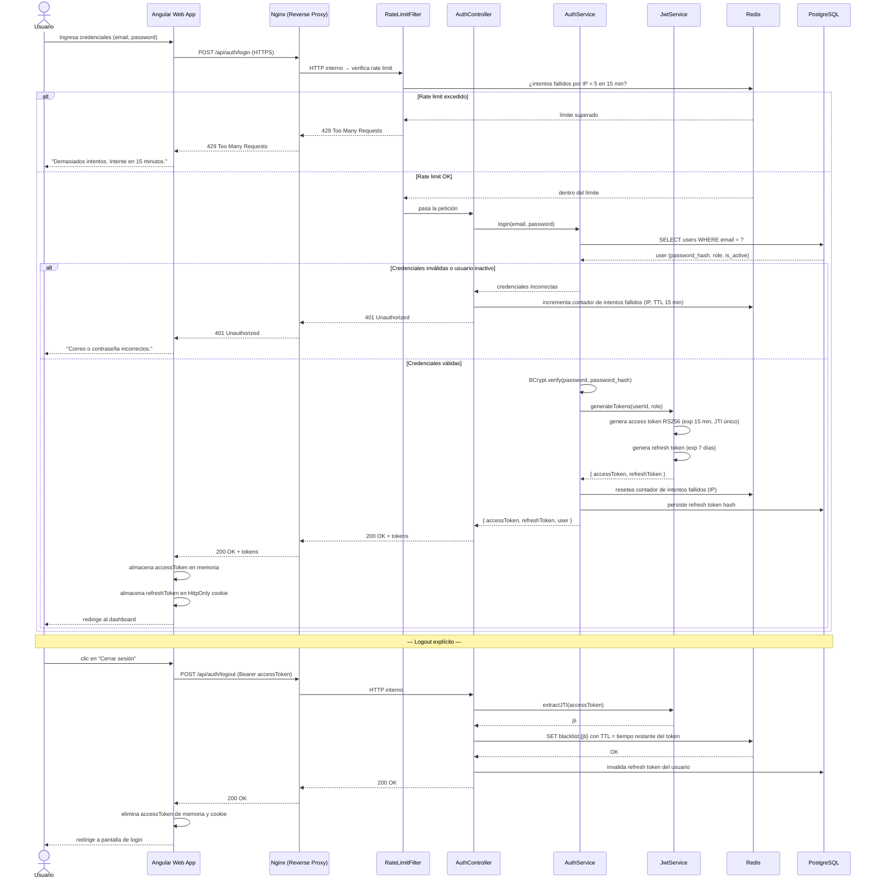
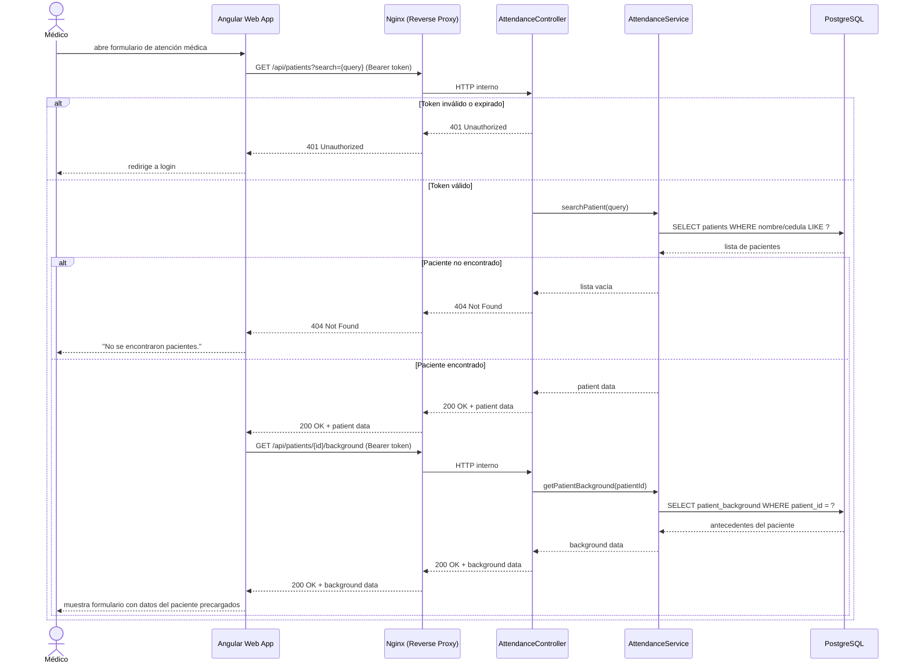
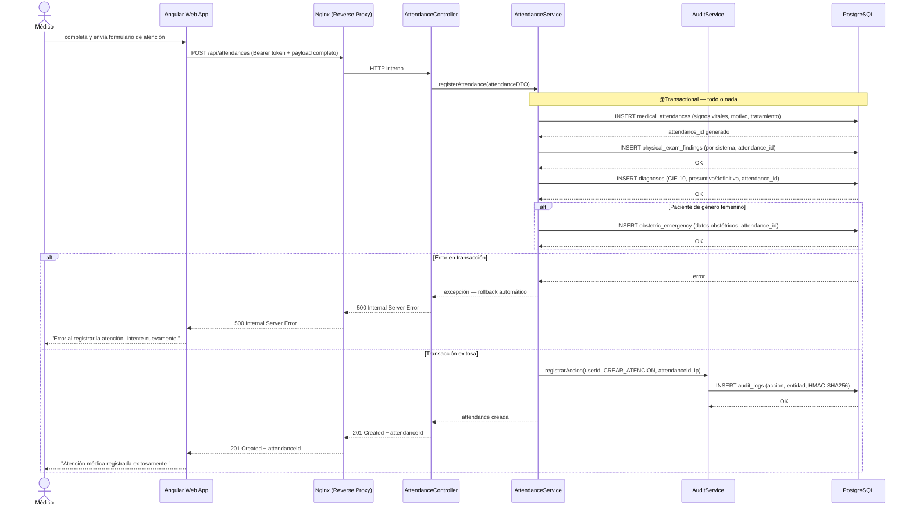
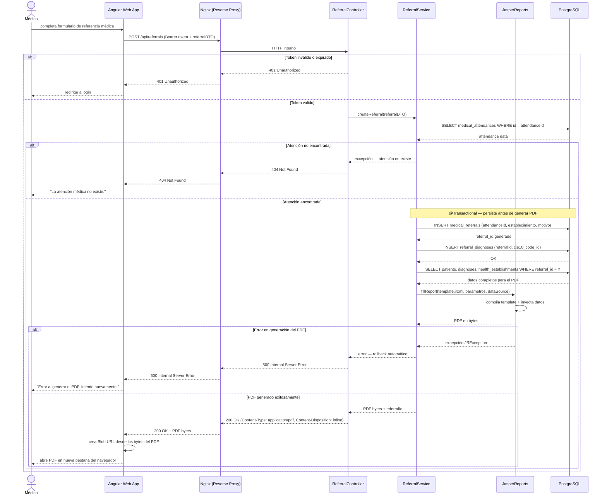
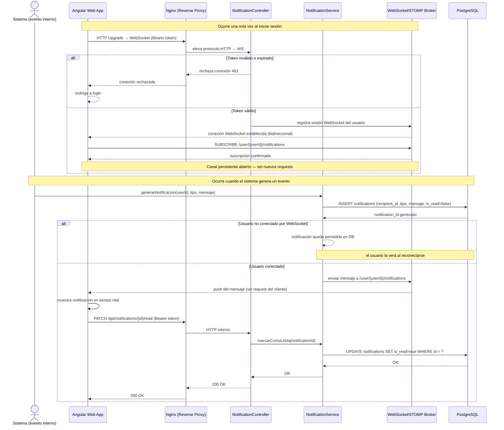

# Diagramas de Secuencia — MEDISTA

**Proyecto:** MEDISTA — Sistema de Gestión de Atención Médica  
**Institución:** Instituto Superior Universitario TEC Azuay  
**Versión:** 1.0  
**Fecha:** 6 de mayo de 2026  
**Fase:** Fase 2 — Diseño del Sistema

---

## Tabla de Contenidos

1. [Descripción General](#1-descripción-general)
2. [Convenciones del Documento](#2-convenciones-del-documento)
3. [Flujo 1 — Login con JWT y Logout Seguro](#3-flujo-1--login-con-jwt-y-logout-seguro)
   - 3.1 [Descripción del Flujo](#31-descripción-del-flujo)
   - 3.2 [Participantes](#32-participantes)
   - 3.3 [Diagrama](#33-diagrama)
   - 3.4 [Notas Técnicas](#34-notas-técnicas)
4. [Flujo 2 — Registro de Atención Médica Completa](#4-flujo-2--registro-de-atención-médica-completa)
   - 4.1 [Descripción del Flujo](#41-descripción-del-flujo)
   - 4.2 [Participantes](#42-participantes)
   - 4.3 [Diagrama — Parte 1: Carga del Formulario](#43-diagrama--parte-1-carga-del-formulario)
   - 4.4 [Diagrama — Parte 2: Registro de Atención](#44-diagrama--parte-2-registro-de-atención)
   - 4.5 [Notas Técnicas](#45-notas-técnicas)
5. [Flujo 3 — Generación de PDF de Referencia Médica](#5-flujo-3--generación-de-pdf-de-referencia-médica)
   - 5.1 [Descripción del Flujo](#51-descripción-del-flujo)
   - 5.2 [Participantes](#52-participantes)
   - 5.3 [Diagrama](#53-diagrama)
   - 5.4 [Notas Técnicas](#54-notas-técnicas)
6. [Flujo 4 — Notificación en Tiempo Real (WebSocket/STOMP)](#6-flujo-4--notificación-en-tiempo-real-websocketstomp)
   - 6.1 [Descripción del Flujo](#61-descripción-del-flujo)
   - 6.2 [Participantes](#62-participantes)
   - 6.3 [Diagrama](#63-diagrama)
   - 6.4 [Notas Técnicas](#64-notas-técnicas)

---

## 1. Descripción General

Este documento especifica los diagramas de secuencia de los flujos principales de MEDISTA. Cada diagrama muestra cómo interactúan los componentes del sistema en el tiempo para completar una operación específica: qué actores y componentes participan, en qué orden se producen las llamadas, qué datos se intercambian y qué decisiones condicionales ocurren en cada flujo.

Los diagramas cubren los cuatro flujos de mayor complejidad técnica del sistema, seleccionados por involucrar múltiples componentes de infraestructura, decisiones condicionales no triviales y mecanismos de seguridad que deben quedar explicitados para guiar la implementación.

Los diagramas visuales generados a partir de estos fuentes Mermaid se encuentran en `docs/03-DESIGN/diagrams/` del repositorio.

---

## 2. Convenciones del Documento

| Elemento | Descripción |
|----------|-------------|
| `-->>` | Mensaje de respuesta (retorno) |
| `->>` | Mensaje de llamada (invocación) |
| `alt / else` | Flujo condicional — caminos mutuamente excluyentes |
| `Note over` | Anotación técnica relevante sobre uno o más participantes |
| `@Transactional` | Indica que las operaciones dentro del bloque forman una unidad atómica — ante cualquier error, todas las operaciones se revierten |

---

## 3. Flujo 1 — Login con JWT y Logout Seguro

### 3.1 Descripción del Flujo

Cubre el ciclo completo de autenticación: desde que el usuario ingresa sus credenciales hasta que recibe los tokens de acceso, incluyendo el logout explícito con invalidación del token en Redis. Este flujo implementa tres capas de seguridad en secuencia: verificación de rate limiting antes de tocar la base de datos, validación de credenciales con BCrypt, y generación de tokens JWT firmados con RS256.

### 3.2 Participantes

| Participante | Tipo | Rol en el flujo |
|--------------|------|-----------------|
| Usuario | Actor | Ingresa credenciales e inicia/cierra sesión |
| Angular Web App | Cliente web | Envía la petición de login y almacena los tokens |
| Nginx | Reverse proxy | Termina TLS y enruta al backend |
| RateLimitFilter | Filtro Spring | Verifica límite de intentos por IP antes de procesar |
| AuthController | Controlador REST | Recibe y responde la petición HTTP |
| AuthService | Servicio | Orquesta la lógica de autenticación |
| JwtService | Servicio | Genera y valida tokens JWT (RS256) |
| Redis | Almacén en memoria | Rate limiting + blacklist de JTIs revocados |
| PostgreSQL | Base de datos | Valida credenciales y persiste refresh tokens |

### 3.3 Diagrama

### 3.4 Notas Técnicas

- **Rate limiting con Redis:** Bucket4j utiliza Redis como backend distribuido. El contador de intentos fallidos se almacena con clave `rate_limit:{ip}` y TTL de 15 minutos. Al superar 5 intentos, el filtro rechaza la petición antes de que llegue al controlador, protegiendo a PostgreSQL de carga innecesaria por ataques de fuerza bruta.
- **RS256 vs HS256:** El sistema utiliza RSA 256 (asimétrico) en lugar de HMAC 256 (simétrico). Esto permite que en el futuro otros servicios validen tokens usando solo la clave pública, sin necesidad de compartir el secreto.
- **JTI (JWT ID):** Cada token lleva un identificador único (UUID v4). Al hacer logout, se almacena ese JTI en Redis como `blacklist:{jti}` con TTL igual al tiempo restante de expiración del token. Cada petición entrante verifica que su JTI no esté en la blacklist, permitiendo la invalidación inmediata sin necesidad de estado en el backend.
- **Almacenamiento de tokens en el cliente:** El access token se almacena en memoria JavaScript (no en localStorage) para prevenir ataques XSS. El refresh token se almacena en una cookie HttpOnly, inaccesible desde JavaScript.

---

## 4. Flujo 2 — Registro de Atención Médica Completa

### 4.1 Descripción del Flujo

Cubre el proceso completo de registro de una atención médica: desde la búsqueda del paciente y carga de sus antecedentes, hasta la persistencia de todos los registros clínicos relacionados dentro de una única transacción atómica. La sección obstétrica se persiste condicionalmente solo cuando el paciente es de género femenino.

### 4.2 Participantes

| Participante | Tipo | Rol en el flujo |
|--------------|------|-----------------|
| Médico | Actor | Busca paciente, completa y envía el formulario |
| Angular Web App | Cliente web | Precarga datos del paciente y envía el formulario completo |
| Nginx | Reverse proxy | Termina TLS y enruta al backend |
| AttendanceController | Controlador REST | Recibe y responde las peticiones HTTP |
| AttendanceService | Servicio | Orquesta la búsqueda y el registro transaccional |
| AuditService | Servicio | Registra la acción en el log de auditoría con HMAC-SHA256 |
| PostgreSQL | Base de datos | Persiste todos los registros clínicos |

### 4.3 Diagrama — Parte 1: Carga del Formulario

### 4.4 Diagrama — Parte 2: Registro de Atención

### 4.5 Notas Técnicas

- **Transacción única (`@Transactional`):** Todas las inserciones — `medical_attendances`, `physical_exam_findings`, `diagnoses` y opcionalmente `obstetric_emergency` — se ejecutan dentro de una misma transacción de base de datos. Si cualquiera de ellas falla, Spring revierte automáticamente todas las operaciones previas, garantizando que nunca quede una atención médica parcialmente registrada.
- **Sección obstétrica condicional:** La inserción en `obstetric_emergency` solo ocurre si el campo `gender` del paciente es `FEMALE`. Esta lógica reside en `AttendanceService`, no en el controlador ni en el cliente.
- **Un solo POST desde el cliente:** El médico no envía múltiples requests para cada sección del formulario. Angular construye un único `AttendanceDTO` con todos los datos y lo envía en una sola operación. El backend descompone ese DTO y ejecuta las inserciones en el orden correcto.
- **Auditoría post-transacción:** El registro en `audit_logs` se realiza después de confirmar la transacción exitosa. El log incluye: `user_id`, acción (`CREAR_ATENCION`), `entity_type`, `entity_id`, IP de origen, `user_agent` y un hash HMAC-SHA256 para garantizar la integridad del registro.

---

## 5. Flujo 3 — Generación de PDF de Referencia Médica

### 5.1 Descripción del Flujo

Cubre el proceso de creación de una referencia médica: desde que el médico completa el formulario de referencia, pasando por la persistencia de los datos en base de datos, hasta la generación del PDF con JasperReports y su entrega al cliente para visualización en el navegador. El PDF generado replica exactamente el formato del formulario físico institucional.

### 5.2 Participantes

| Participante | Tipo | Rol en el flujo |
|--------------|------|-----------------|
| Médico | Actor | Completa y envía el formulario de referencia |
| Angular Web App | Cliente web | Envía el formulario y abre el PDF recibido en nueva pestaña |
| Nginx | Reverse proxy | Termina TLS, enruta REST y gestiona timeout para generación de PDF |
| ReferralController | Controlador REST | Recibe la petición y devuelve el PDF como respuesta binaria |
| ReferralService | Servicio | Persiste la referencia y coordina la generación del PDF |
| JasperReports | Motor de reportes | Compila el template `.jrxml` e inyecta los datos para producir el PDF |
| PostgreSQL | Base de datos | Persiste la referencia y provee los datos necesarios para el PDF |

### 5.3 Diagrama

### 5.4 Notas Técnicas

- **Persistencia antes de generación:** Los datos de la referencia se insertan en `medical_referrals` y `referral_diagnoses` antes de llamar a JasperReports. Si la generación del PDF falla, el rollback de la transacción garantiza que no queden referencias huérfanas en la base de datos.
- **Template `.jrxml`:** JasperReports utiliza un archivo de template que replica el formato exacto del Formulario de Referencia Médica físico del Departamento Médico TEC Azuay. El template se compila en tiempo de inicialización del backend y se reutiliza en cada generación para evitar overhead.
- **Entrega del PDF:** El controlador responde con `Content-Type: application/pdf` y `Content-Disposition: inline`. El header `inline` instruye al navegador a mostrar el PDF dentro de una nueva pestaña en lugar de forzar la descarga. Angular construye un `Blob URL` desde los bytes recibidos y lo abre con `window.open()`.
- **Timeout en Nginx:** La generación de PDFs complejos puede superar el timeout por defecto de Nginx. Se configura un `proxy_read_timeout` extendido específicamente para los endpoints de generación de reportes.

---

## 6. Flujo 4 — Notificación en Tiempo Real (WebSocket/STOMP)

### 6.1 Descripción del Flujo

Cubre dos sub-flujos relacionados: el establecimiento de la conexión WebSocket persistente al iniciar sesión (handshake y suscripción al topic personal), y la entrega de una notificación generada por el sistema al cliente Angular sin que este haya realizado ningún request. Este flujo es bidireccional — a diferencia de REST, el servidor puede enviar mensajes al cliente en cualquier momento mientras la conexión esté activa.

### 6.2 Participantes

| Participante | Tipo | Rol en el flujo |
|--------------|------|-----------------|
| Sistema | Actor interno | Genera el evento que dispara la notificación |
| Angular Web App | Cliente web | Establece la conexión WS y recibe notificaciones en tiempo real |
| Nginx | Reverse proxy | Eleva el protocolo HTTP a WebSocket (upgrade) |
| NotificationController | Controlador WS | Gestiona el handshake y la autenticación de la conexión |
| NotificationService | Servicio | Persiste la notificación y la despacha al broker STOMP |
| WebSocket/STOMP Broker | Broker de mensajería | Enruta los mensajes a los topics suscritos por cada cliente |
| PostgreSQL | Base de datos | Persiste las notificaciones para usuarios no conectados |

### 6.3 Diagrama

### 6.4 Notas Técnicas

- **WebSocket es bidireccional:** A diferencia de HTTP (donde el cliente siempre inicia), WebSocket establece un canal persistente full-duplex. Una vez establecida la conexión, el servidor puede enviar mensajes al cliente en cualquier momento sin que este los solicite. Esta es la propiedad fundamental que habilita las notificaciones en tiempo real.
- **STOMP sobre WebSocket:** STOMP (Simple Text Oriented Messaging Protocol) provee un modelo de publicación/suscripción sobre la conexión WebSocket. Cada usuario autenticado se suscribe a su topic personal `/user/{userId}/notifications`. Spring Boot incluye un broker STOMP embebido a través de `spring-boot-starter-websocket`.
- **Nginx WebSocket upgrade:** Nginx debe estar configurado con los headers `Upgrade` y `Connection` para elevar el protocolo HTTP a WebSocket. Sin esta configuración, el proxy cierra la conexión y el handshake falla.
- **Persistencia para usuarios desconectados:** Toda notificación se persiste en la tabla `notifications` antes de intentar el envío por WebSocket. Si el usuario no está conectado en ese momento, la notificación permanece en base de datos con `is_read = false` y se muestra al usuario cuando se conecte o refresque la aplicación.
- **Marcado como leída:** Al recibir y mostrar la notificación, Angular realiza automáticamente un `PATCH /api/notifications/{id}/read` para actualizar el estado en base de datos. Este request sí es HTTP REST estándar, no WebSocket.

---

*MEDISTA — Diagramas de Secuencia v1.0 — Instituto Superior Universitario TEC Azuay — Mayo 2026*
